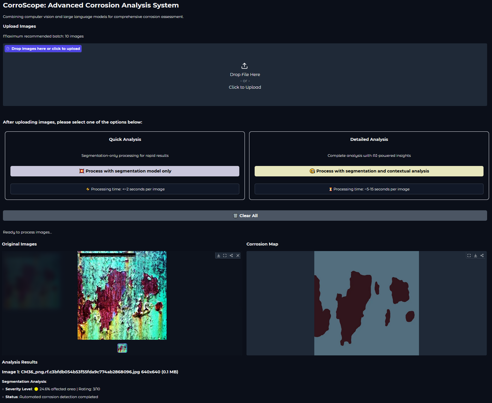

# CorroScope: Advanced Corrosion Analysis System

CorroScope is a corrosion assessment tool that combines computer vision and large language models for advanced corrosion analysis. This tool allows users to upload images of structural steel corrosion and receive detailed analysis and recommendations.

## Features

- **Segmentation Model**: Uses a pre-trained Vision Transformer (ViT) model to detect and segment corrosion areas in the uploaded images.
- **Contextual Analysis**: Leverages OpenAI's language model to provide a detailed analysis of the corrosion, including severity rating, description, confidence score, and recommendations.
- **Batch Processing**: Supports batch processing of multiple images with both quick segmentation and detailed contextual analysis.

## Installation

1. **Clone the repository**:
    ```bash
    git clone https://github.com/yourusername/corroscope.git
    cd corroscope
    ```

2. **Install dependencies**:
    ```bash
    pip install -r requirements.txt
    ```

3. **Set up environment variables**:
    Create a `.env` file in the root directory and add your OpenAI API key:
    ```env
    OPENAI_API_KEY=your_openai_api_key
    ```

4. **Download the model weights**:
    Place the model weights file (`statdict.pth`) in the `models` directory.

## Usage

1. **Run the application**:
    ```bash
    python app.py
    ```

2. **Upload Images**:
    - Drag and drop images or click to upload.
    - Maximum recommended batch size: 10 images.

3. **Select Processing Options**:
    - **Quick Analysis**: Segmentation-only processing for rapid results.
    - **Detailed Analysis**: Complete analysis with AI-powered insights.

4. **View Results**:
    - Original images with text overlay.
    - Corrosion detection mask.
    - Detailed analysis results including severity rating and recommendations.

## Model Training

The Vision Transformer model was trained using a two-step approach:
1. **Pre-training**: The model was pre-trained on a comprehensive segmentation dataset collected from the available datasets online. This helped the model to learn general features.
2. **Fine-tuning**: Samples of complicated cases were annotated using weakly semi-supervised learning, and the model was fine-tuned on these samples to improve its performance on challenging scenarios.

The decision to not use CNN models (versions of HRNet) was primarily due to their bias towards texture, which might lead to poor generalization on out-of-distribution images.

## Example

Here is an example of how the interface looks:



## Contributing

Contributions are welcome! Please fork the repository and submit a pull request.

## License

This project is licensed under the Creative Commons Attribution-NonCommercial (CC BY-NC) License. See the [LICENSE](LICENSE) file for details.

## Acknowledgements

- [Gradio](https://gradio.app/)
- [OpenAI](https://openai.com/)
- [Albumentations](https://albumentations.ai/)
- [TransUNet](https://github.com/Beckschen/TransUNet)
